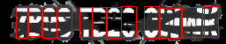

# Obfuscated-text-OCR

## Overview

This project is designed to detect and read distorted text from images, specifically for the purpose of identifying and extracting coupon codes. The system uses advanced deep learning techniques, including Convolutional Neural Networks (CNNs) and Residual Networks (ResNet), to accurately identify and classify characters in challenging visual conditions.

## Key Features

- **Character Detection and Classification**: Utilizes Mask R-CNN with a ResNet backbone to detect and classify characters in images.
- **Custom Dataset Handling**: Includes a custom dataset class for loading images and annotations, and preprocessing them for training.
- **Image Transformation**: Applies various transformations to images to prepare them for model input.
- **Training and Inference**: Provides scripts for training the model on a dataset and for running inference to detect characters in new images.
- **Visualization**: Includes functionality to visualize transformed images and model predictions for debugging and analysis.

## Techniques Used

- **Mask R-CNN**: A state-of-the-art object detection model that extends Faster R-CNN by adding a branch for predicting segmentation masks on each Region of Interest (RoI).
- **ResNet (Residual Network)**: A deep neural network architecture that uses residual connections to enable the training of very deep networks. This project uses ResNet as the backbone for the Mask R-CNN model.
- **Convolutional Neural Networks (CNNs)**: Used for feature extraction from images, enabling the model to learn complex patterns and representations.
- **Data Augmentation and Preprocessing**: Includes various techniques for augmenting and preprocessing images to improve model robustness and performance.

## Project Structure

- **src/OCR/train.py**: Contains the training script for the Mask R-CNN model, including dataset loading, model initialization, and training loop.
- **src/OCR/detect.py**: Script for running inference with the trained model to detect characters in new images.
- **src/OCR/OCR.py**: Contains the main OCR functionality, including reading coupon codes from images.
- **src/OCR/generate_images.py**: Script for generating images with coupon codes for training and testing.
- **src/generate_images/generateCoupon.py**: Contains the function to generate coupon images with text.

## Example Process

Here is an example of the process an image goes through in this project:

1. **Input Image**:
   

2. **Preprocessing**:
   

3. **Output Image**:
   
With following predictions
```
 1. 7 (conf: 0.96) at [18, 8] -> [31, 43]
 2. B (conf: 0.94) at [32, 8] -> [47, 41]
 3. 9 (conf: 0.90) at [48, 8] -> [64, 43]
 4. S (conf: 0.98) at [64, 8] -> [81, 42]
 5. T (conf: 0.95) at [90, 8] -> [104, 42]
 6. B (conf: 0.90) at [104, 8] -> [120, 42]
 7. 2 (conf: 0.99) at [121, 8] -> [137, 43]
 8. G (conf: 0.91) at [137, 7] -> [154, 42]
 9. 3 (conf: 0.72) at [163, 7] -> [180, 43]
10. W (conf: 0.99) at [181, 9] -> [205, 43]
11. W (conf: 1.00) at [206, 8] -> [231, 42]
12. K (conf: 1.00) at [229, 7] -> [247, 42]
```   

## Acknowledgements

This project leverages several powerful libraries and frameworks, including:

- **PyTorch**: For building and training the deep learning models.
- **Torchvision**: For pre-trained models and image transformations.